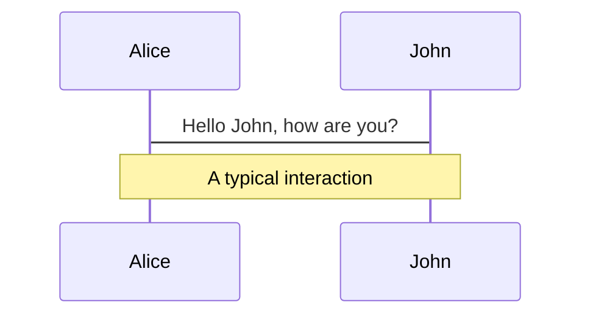
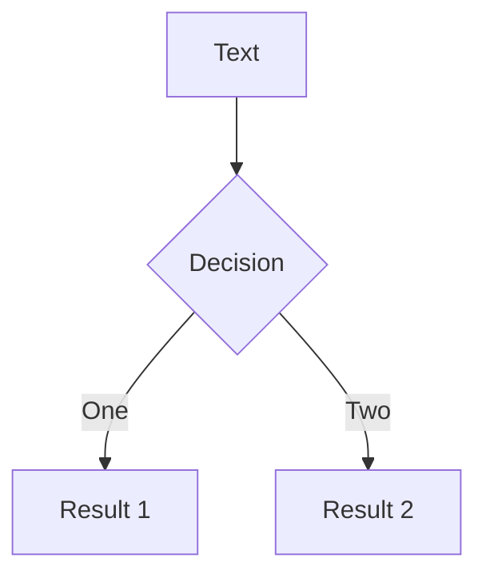
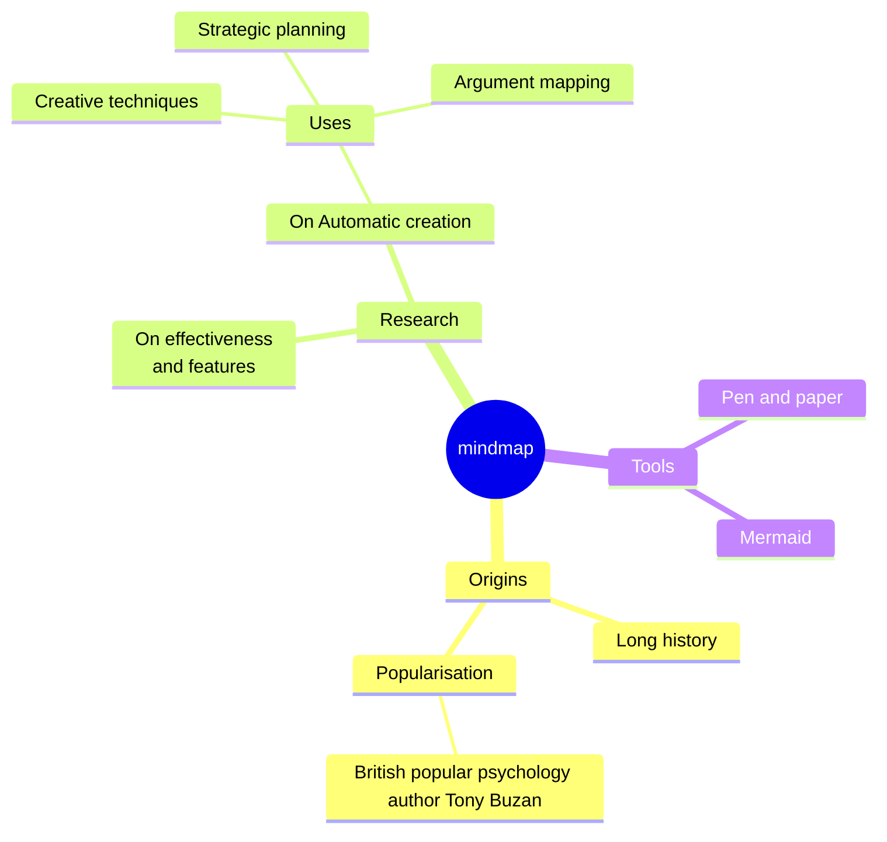
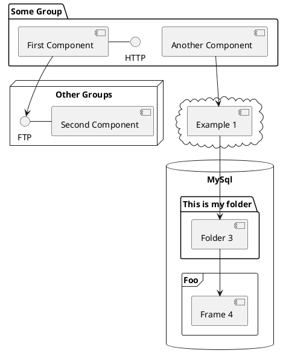

---
# try also 'default' to start simple
theme: default
# random image from a curated Unsplash collection by Anthony
# like them? see https://unsplash.com/collections/94734566/slidev
# some information about your slides, markdown enabled
title: Welcome to Slidev
info: |
  ## Slidev Starter Template
  Presentation slides for developers.

  Learn more at [Sli.dev](https://sli.dev)
# apply any unocss classes to the current slide
class: text-center
# https://sli.dev/custom/highlighters.html
highlighter: shiki
# https://sli.dev/guide/drawing
drawings:
  persist: false
# slide transition: https://sli.dev/guide/animations#slide-transitions
transition: slide-left
# enable MDC Syntax: https://sli.dev/guide/syntax#mdc-syntax
mdc: true
---

# Ayudantía 2 - Webdev

<!--
The last comment block of each slide will be treated as slide notes. It will be visible and editable in Presenter Mode along with the slide. [Read more in the docs](https://sli.dev/guide/syntax.html#notes)
-->

---
transition: fade-out
layout: default
---

# Repaso syntax de JS

### Declaración de variables, objetos y arrays
```js

const constantVariable = 'foo'
let mutableVariable = 'bar'

// Array of strings
const myFavoriteSeries = ['Breaking bad', 'Better Call Saul']

//Declaration of object
const myCat = {
  name: 'Matilda',
  years: 2,
  favoriteFood: 'Churu',
  talk: () => console.log('Meow')
}


```


<style>
h1 {
  background-color: #2B90B6;
  background-image: linear-gradient(45deg, #4EC5D4 10%, #146b8c 20%);
  background-size: 100%;
  -webkit-background-clip: text;
  -moz-background-clip: text;
  -webkit-text-fill-color: transparent;
  -moz-text-fill-color: transparent;
}
</style>

<!--
Here is another comment.
-->

---
transition: slide-up
level: 2

---

# Arrays

Existen múltiples métodos, estos son algunos de ellos. Para más información: <br/>
[Mdn docs](https://developer.mozilla.org/en-US/docs/Web/JavaScript/Reference/Global_Objects/Array)
```js twoslash

const names = ['Francisco', 'Loreto', 'Sofia', 'Cesar', 'Felipe']

//Obtain first name of the array
const firstNameOfArray = names[0]
const alsoFirstNameOfArray = names.at(0)

const indexOfLoreto = names.indexOf('Loreto')

//Filtering
const namesThatStartWithF = names.filter(name => name.startsWith('F')) // Returns ['Francisco', 'Felipe']

//Mapping
const lopezFamily = names.map(name => `${name} Lopez`)
// Returns ['Francisco Lopez', ..., ..., ...]

```


---
transition: slide-up
level: 2

---

# Objetos

Existen múltiples métodos, estos son algunos de ellos. Para más información: <br/>
[Mdn docs](https://developer.mozilla.org/en-US/docs/Web/JavaScript/Reference/Global_Objects/Array)
```js twoslash
const product = {
  name: 'Apple',
  price: 1.99,
  category: 'Fruits',
  nutrients: {
    carbs: 0.95,
    fat: 0.3,
    prot: 0.2
  }
}

//Access to properties
console.log(product.name)
console.log(product.nutrients.carbs)

//Add new properties
product.color = 'Green'
```


---
transition: slide-up
level: 2

---

# Manipulación del dom

JS nos ofrece métodos para acceder a elementos del DOM bajo criterios de selección. <br/>
Los métodos que pueden retornar múltiples elementos, retornan HTMLCollections, que son array-like, pero no arrays.

<div class='grid grid-cols-2 w-full  gap-4'>

```js twoslash

const firstSection = document.getElementById('first-section')
const headings = document.getElementsByTagName('h1')
// Cast HTMLCollection to Array
const primaryButtons = [...document.getElementsByClassName('btn-primary')]

primaryButtons.forEach(button => {
  return button.style.color = 'red'
})

//Render new element inside first-section 
const newSpan = document.createElement('span')
newSpan.textContent = 'Lorem ipsum dolor sit amet'
firstSection.appendChild(newSpan)

```


```html 
<main>
  <section id='first-section'>
    <h1>Mi first webpage!</h1>
    <p>Next step: Hack the NASA</p>
    </section>
  <section>
    <form>
      <label for="firstName">First name:</label><br>
      <input type="text" id="firstName" name="firstName" value="John">
      <label for="lastName">Last name:</label><br>
      <input type="text" id="lastName" name="lastName" value="Doe">
      <input type="submit" class='btn btn-primary' value="Submit">
    </form>
  </section>
</main>
```
</div>


---
layout:default
level:2
---

# Flexbox

Herramienta de CSS que permite ordenar los elementos de un contenedor en columnas o filas. Además <br/>
de permitir controlar su espaciado y comportamiento.

<div class='grid grid-cols-2 gap-10 items-center'>
  <div>

  ### Display y direction
  Lo escencial para asignarle el comportamiento flex a un contenedor. <br/>
  Para darle una dirección, utilizar flex-direction

  ```css
  .container {
    display: flex;
    flex-direction: row | row-reverse | column | column-reverse;
  }
  ```
  </div>
</img>
</div>


---
layout:default
level:2
---

# Más propiedades de flex


<div class='grid grid-cols-2 gap-10 items-center'>
  <div>

  ### Flex wrap
  Por defecto, los childs del container van a intentar caber solo en una linea, sin importar si sobrepasan el contenedor <br/>
  Para manejar este comportamiento:

  ```css
  .container {
      flex-wrap: nowrap | wrap | wrap-reverse;
  }
  ```
  Existen shorthands para describir el comportamiento del contenedor de manera más corta. <br/>
  Para describir la dirección y el comportamiendo de wrap:
  ```css
  .container {
        flex-flow: column wrap
  }
  ```
  </div>
</img>
</div>


---
layout:default
level:2
---

# Más propiedades de flex


<div class='grid grid-cols-2 gap-10 items-start '>
  <div>

  ### Justify content
  Permite controlar el espaciado entre los childs del contenedor sobre el eje principal. <br/>
  Si la dirección es row, manejará el espaciado en el eje X, en caso contrario, en el eje Y.

  ```css
  .container {
      display:flex;
      flex-direction:row;
      justify-content: flex-start | flex-end | center | space-between | space-around | space-evenly
  }
  ```
 
  </div>
</img>
</div>


---
layout:default
level:2
---

# Más propiedades de flex


<div class='grid grid-cols-2 gap-10 items-start '>
  <div>

  ### Align items
  Permite controlar como se distribuyen los childs del contenedor sobre el eje secundario. <br/>
  Si la dirección es row, manejará la distribución en el eje Y, en caso contrario, en el eje X.

  ```css
  .container {
      display:flex;
      flex-direction:row;
      align-items: stretch | flex-start | flex-end | center | baseline | first baseline | last baseline | start | end | self-start | self-end + ... safe | unsafe;
  }
  ```
 
  </div>
</img>
</div>


---
layout:default
level:2
---

# Más propiedades de flex


<div class='grid grid-cols-2 gap-10 items-start '>
  <div>

  ### Gap
  Permite controlar la separación entre elementos. <br/>
  Se puede utilizar una regla general para ambos, o modificarlos granularmente.

  ```css
  .container {
      display: flex;
      gap: 10px;
      gap: 10px 20px; /* row-gap column'gap */
      row-gap: 10px;
      column-gap: 20px;
  }
  ```
 
  </div>
</img>
</div>


---
layout:default
---

# Bootstrap
Framework de desarrollo web para facilitar el desarrollo de sitios responsivos y con la filosfía mobile first. <br/>
Entrega una serie de estilos y utilidades para optimizar el tiempo de desarrollo. 
<div class='flex gap-10 items-center justify-evenly mt-10'>

<div>


<small class='opacity-50 text-xs'>Hero component hecho con bootstrap</small>
</div>

</div>


---
layout: default
---

# Cómo estilar componentes comunes con Bootstrap

```html

<!doctype html>
<html lang="en">
  <head>
    <meta charset="utf-8">
    <meta name="viewport" content="width=device-width, initial-scale=1">
    <title>Bootstrap demo</title>
    <link href="https://cdn.jsdelivr.net/npm/bootstrap@5.3.3/dist/css/bootstrap.min.css" rel="stylesheet" integrity="sha384-QWTKZyjpPEjISv5WaRU9OFeRpok6YctnYmDr5pNlyT2bRjXh0JMhjY6hW+ALEwIH" crossorigin="anonymous">
  </head>
  <body>
    <h1>Hello, world!</h1>
    <script src="https://cdn.jsdelivr.net/npm/bootstrap@5.3.3/dist/js/bootstrap.bundle.min.js" integrity="sha384-YvpcrYf0tY3lHB60NNkmXc5s9fDVZLESaAA55NDzOxhy9GkcIdslK1eN7N6jIeHz" crossorigin="anonymous"></script>
  </body>
</html>

```

---
level: 2
---

# Creando componentes con Bootstrap
Clickea en Edit on codepen para ir directamente al sitio para editar el código.
<iframe  style="width: 100%; height:80%;" scrolling="no" title="Ayudantia 2 - Bootstrap example" src="https://codepen.io/Agatsuma_/embed/YzMVgaE?default-tab=html%2Cresult" frameborder="no" loading="lazy" allowtransparency="true" allowfullscreen="true">
  See the Pen <a href="https://codepen.io/Agatsuma_/pen/YzMVgaE">
  Ayudantia 2 - Bootstrap example</a> by José Tomás (<a href="https://codepen.io/Agatsuma_">@Agatsuma_</a>)
  on <a href="https://codepen.io">CodePen</a>.
</iframe>

[Link al proyecto](https://codepen.io/Agatsuma_/pen/YzMVgaE)

---

# Componentes típicos de Bootstrap

<div grid="~ cols-2 gap-4">
<div>

You can use Vue components directly inside your slides.

We have provided a few built-in components like `<Tweet/>` and `<Youtube/>` that you can use directly. And adding your custom components is also super easy.

```html
<Counter :count="10" />
```

<!-- ./components/Counter.vue -->
<Counter :count="10" m="t-4" />

Check out [the guides](https://sli.dev/builtin/components.html) for more.

</div>
<div>

```html
<Tweet id="1390115482657726468" />
```

<Tweet id="1390115482657726468" scale="0.65" />

</div>
</div>

<!--
Presenter note with **bold**, *italic*, and ~~striked~~ text.

Also, HTML elements are valid:
<div class="flex w-full">
  <span style="flex-grow: 1;">Left content</span>
  <span>Right content</span>
</div>
-->

---
class: px-20
---

# Themes

Slidev comes with powerful theming support. Themes can provide styles, layouts, components, or even configurations for tools. Switching between themes by just **one edit** in your frontmatter:

<div grid="~ cols-2 gap-2" m="t-2">

```yaml
---
theme: default
---
```

```yaml
---
theme: seriph
---
```


</div>

Read more about [How to use a theme](https://sli.dev/themes/use.html) and
check out the [Awesome Themes Gallery](https://sli.dev/themes/gallery.html).

---

# Clicks Animations

You can add `v-click` to elements to add a click animation.

<div v-click>

This shows up when you click the slide:

```html
<div v-click>This shows up when you click the slide.</div>
```

</div>

<br>

<v-click>

The <span v-mark.red="3"><code>v-mark</code> directive</span>
also allows you to add
<span v-mark.circle.orange="4">inline marks</span>
, powered by [Rough Notation](https://roughnotation.com/):

```html
<span v-mark.underline.orange>inline markers</span>
```

</v-click>

<div mt-20 v-click>

[Learn More](https://sli.dev/guide/animations#click-animations)

</div>

---
preload: false
---

# Motions

Motion animations are powered by [@vueuse/motion](https://motion.vueuse.org/), triggered by `v-motion` directive.

```html
<div
  v-motion
  :initial="{ x: -80 }"
  :enter="{ x: 0 }">
  Slidev
</div>
```

<div class="w-60 relative mt-6">
  <div class="relative w-40 h-40">
    
    
    
  </div>

  <div
    class="text-5xl absolute top-14 left-40 text-[#2B90B6] -z-1"
    v-motion
    :initial="{ x: -80, opacity: 0}"
    :enter="{ x: 0, opacity: 1, transition: { delay: 2000, duration: 1000 } }">
    Slidev
  </div>
</div>

<!-- vue script setup scripts can be directly used in markdown, and will only affects current page -->
<script setup lang="ts">
const final = {
  x: 0,
  y: 0,
  rotate: 0,
  scale: 1,
  transition: {
    type: 'spring',
    damping: 10,
    stiffness: 20,
    mass: 2
  }
}
</script>

<div
  v-motion
  :initial="{ x:35, y: 40, opacity: 0}"
  :enter="{ y: 0, opacity: 1, transition: { delay: 3500 } }">

[Learn More](https://sli.dev/guide/animations.html#motion)

</div>

---

# LaTeX

LaTeX is supported out-of-box powered by [KaTeX](https://katex.org/).

<br>

Inline $\sqrt{3x-1}+(1+x)^2$

Block
$$ {1|3|all}
\begin{array}{c}

\nabla \times \vec{\mathbf{B}} -\, \frac1c\, \frac{\partial\vec{\mathbf{E}}}{\partial t} &
= \frac{4\pi}{c}\vec{\mathbf{j}}    \nabla \cdot \vec{\mathbf{E}} & = 4 \pi \rho \\

\nabla \times \vec{\mathbf{E}}\, +\, \frac1c\, \frac{\partial\vec{\mathbf{B}}}{\partial t} & = \vec{\mathbf{0}} \\

\nabla \cdot \vec{\mathbf{B}} & = 0

\end{array}
$$

<br>

[Learn more](https://sli.dev/guide/syntax#latex)

---

# Diagrams

You can create diagrams / graphs from textual descriptions, directly in your Markdown.

<div class="grid grid-cols-4 gap-5 pt-4 -mb-6">









</div>

[Learn More](https://sli.dev/guide/syntax.html#diagrams)

---
src: ./pages/multiple-entries.md
hide: false
---

---

# Monaco Editor

Slidev provides built-in Moanco Editor support.

Add `{monaco}` to the code block to turn it into an editor:

```ts {monaco}
import { ref } from 'vue'
import hello from './external'

const code = ref('const a = 1')
hello()
```

Use `{monaco-run}` to create an editor that can execute the code directly in the slide:

```ts {monaco-run}
function fibonacci(n: number): number {
  return n <= 1
    ? n
    : fibonacci(n - 1) + fibonacci(n - 2) // you know, this is NOT the best way to do it :P
}

console.log(Array.from({ length: 10 }, (_, i) => fibonacci(i + 1)))
```

---
layout: center
class: text-center
---

# Learn More

[Documentations](https://sli.dev) · [GitHub](https://github.com/slidevjs/slidev) · [Showcases](https://sli.dev/showcases.html)
