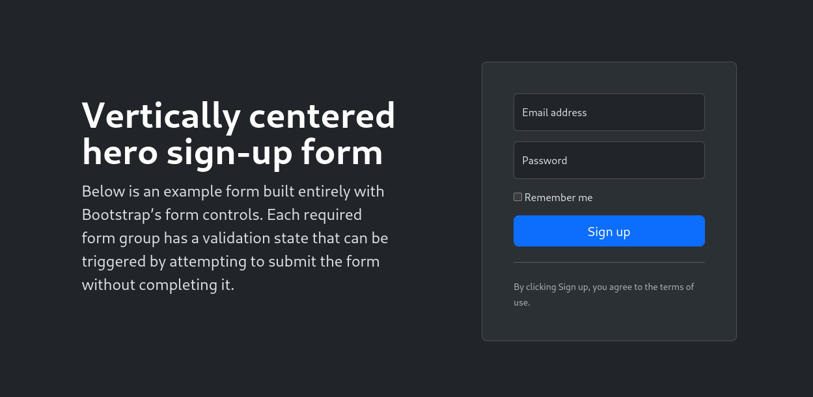

# Ayudantía 2 - Webdev


---
layout: default
---

# Repaso syntax de JS

### Declaración de variables, objetos y arrays
```js

const constantVariable = 'foo'
let mutableVariable = 'bar'

// Array of strings
const myFavoriteSeries = ['Breaking bad', 'Better Call Saul']

//Declaration of object
const myCat = {
  name: 'Matilda',
  years: 2,
  favoriteFood: 'Churu',
  talk: () => console.log('Meow')
}


```


<style>
h1 {
  background-color: #2B90B6;
  background-image: linear-gradient(45deg, #4EC5D4 10%, #146b8c 20%);
  background-size: 100%;
  -webkit-background-clip: text;
  -moz-background-clip: text;
  -webkit-text-fill-color: transparent;
  -moz-text-fill-color: transparent;
}
</style>

---
level: 2

---

# Arrays

Existen múltiples métodos, estos son algunos de ellos. Para más información: <br/>
[Mdn docs](https://developer.mozilla.org/en-US/docs/Web/JavaScript/Reference/Global_Objects/Array)
```js twoslash

const names = ['Francisco', 'Loreto', 'Sofia', 'Cesar', 'Felipe']

//Obtain first name of the array
const firstNameOfArray = names[0]
const alsoFirstNameOfArray = names.at(0)

const indexOfLoreto = names.indexOf('Loreto')

//Filtering
const namesThatStartWithF = names.filter(name => name.startsWith('F')) // Returns ['Francisco', 'Felipe']

//Mapping
const lopezFamily = names.map(name => `${name} Lopez`)
// Returns ['Francisco Lopez', ..., ..., ...]

```


---
level: 2
---

# Objetos

Existen múltiples métodos, estos son algunos de ellos. Para más información: <br/>
[Mdn docs](https://developer.mozilla.org/en-US/docs/Web/JavaScript/Reference/Global_Objects/Array)
```js twoslash
const product = {
  name: 'Apple',
  price: 1.99,
  category: 'Fruits',
  nutrients: {
    carbs: 0.95,
    fat: 0.3,
    prot: 0.2
  }
}

//Access to properties
console.log(product.name)
console.log(product.nutrients.carbs)

//Add new properties
product.color = 'Green'
```


---
level: 2
---

# Manipulación del dom

JS nos ofrece métodos para acceder a elementos del DOM bajo criterios de selección. <br/>
Los métodos que pueden retornar múltiples elementos, retornan HTMLCollections, que son array-like, pero no arrays.

<div class='grid grid-cols-2 w-full  gap-4'>

```js twoslash

const firstSection = document.getElementById('first-section')
const headings = document.getElementsByTagName('h1')
// Cast HTMLCollection to Array
const primaryButtons = [...document.getElementsByClassName('btn-primary')]

primaryButtons.forEach(button => {
  return button.style.color = 'red'
})

//Render new element inside first-section 
const newSpan = document.createElement('span')
newSpan.textContent = 'Lorem ipsum dolor sit amet'
firstSection.appendChild(newSpan)

```


```html 
<main>
  <section id='first-section'>
    <h1>Mi first webpage!</h1>
    <p>Next step: Hack the NASA</p>
    </section>
  <section>
    <form>
      <label for="firstName">First name:</label><br>
      <input type="text" id="firstName" name="firstName" value="John">
      <label for="lastName">Last name:</label><br>
      <input type="text" id="lastName" name="lastName" value="Doe">
      <input type="submit" class='btn btn-primary' value="Submit">
    </form>
  </section>
</main>
```
</div>


---
layout:default
level:2
---

# Flexbox

Herramienta de CSS que permite ordenar los elementos de un contenedor en columnas o filas. Además <br/>
de permitir controlar su espaciado y comportamiento.

<div class='grid grid-cols-3 gap-10 items-center'>
  <div class='col-span-2'>

  ### Display y direction
  Lo escencial para asignarle el comportamiento flex a un contenedor. <br/>
  Para darle una dirección, utilizar flex-direction

  ```css
  .container {
    display: flex;
    flex-direction: row | row-reverse | column | column-reverse;
  }
  ```
  </div>
</img>
</div>


---
layout:default
level:2
---

# Más propiedades de flex


<div class='grid grid-cols-2 gap-10 items-center'>
  <div>

  ### Flex wrap
  Por defecto, los childs del container van a intentar caber solo en una linea, sin importar si sobrepasan el contenedor <br/>
  Para manejar este comportamiento:

  ```css
  .container {
      flex-wrap: nowrap | wrap | wrap-reverse;
  }
  ```
  Existen shorthands para describir el comportamiento del contenedor de manera más corta. <br/>
  Para describir la dirección y el comportamiendo de wrap:
  ```css
  .container {
        flex-flow: column wrap
  }
  ```
  </div>
</img>
</div>


---
layout:default
level:2
---

# Más propiedades de flex


<div class='grid grid-cols-3 gap-5 items-start '>
  <div class='col-span-2'>

  ### Justify content
  Permite controlar el espaciado entre los childs del contenedor sobre el eje principal. <br/>
  Si la dirección es row, manejará el espaciado en el eje X, en caso contrario, en el eje Y.

  ```css
  .container {
      display:flex;
      flex-direction:row;
      justify-content: flex-start | flex-end | center | space-between | space-around | space-evenly
  }
  ```
 
  </div>
</img>
</div>


---
layout:default
level:2
---

# Más propiedades de flex


<div class='grid grid-cols-3 gap-10 items-start '>
  <div class='col-span-2'>

  ### Align items
  Permite controlar como se distribuyen los childs del contenedor sobre el eje secundario. <br/>
  Si la dirección es row, manejará la distribución en el eje Y, en caso contrario, en el eje X.

  ```css
  .container {
      display:flex;
      flex-direction:row;
      align-items: stretch | flex-start | flex-end | center | baseline | first baseline | last baseline | start | end | self-start | self-end + ... safe | unsafe;
  }
  ```
 
  </div>
</img>
</div>


---
layout:default
level:2
---

# Más propiedades de flex


<div class='grid grid-cols-2 gap-10 items-start '>
  <div>

  ### Gap
  Permite controlar la separación entre elementos. <br/>
  Se puede utilizar una regla general para ambos, o modificarlos granularmente.

  ```css
  .container {
      display: flex;
      gap: 10px;
      gap: 10px 20px; /* row-gap column'gap */
      row-gap: 10px;
      column-gap: 20px;
  }
  ```
 
  </div>
</img>
</div>


---
layout:default
---

# Bootstrap
Framework de desarrollo web para facilitar el desarrollo de sitios responsivos y con la filosfía mobile first. <br/>
Entrega una serie de estilos y utilidades para optimizar el tiempo de desarrollo. 
<div class='flex gap-10 items-center justify-evenly mt-10'>

<div>


<small class='opacity-50 text-xs'>Hero component hecho con bootstrap</small>
</div>

</div>


---
layout: default
---

# Importar bootstrap en nuestro proyecto

```html

<!doctype html>
<html lang="en">
  <head>
    <meta charset="utf-8">
    <meta name="viewport" content="width=device-width, initial-scale=1">
    <title>Bootstrap demo</title>
    <link href="https://cdn.jsdelivr.net/npm/bootstrap@5.3.3/dist/css/bootstrap.min.css" rel="stylesheet" integrity="sha384-QWTKZyjpPEjISv5WaRU9OFeRpok6YctnYmDr5pNlyT2bRjXh0JMhjY6hW+ALEwIH" crossorigin="anonymous">
  </head>
  <body>
    <h1>Hello, world!</h1>
    <script src="https://cdn.jsdelivr.net/npm/bootstrap@5.3.3/dist/js/bootstrap.bundle.min.js" integrity="sha384-YvpcrYf0tY3lHB60NNkmXc5s9fDVZLESaAA55NDzOxhy9GkcIdslK1eN7N6jIeHz" crossorigin="anonymous"></script>
  </body>
</html>

```
---
layout:default
level:2
---

# Flexbox con bootstrap

Bootstrap nos entrega "utility classes" para representar CSS a través de clases.


  ### Declarar un contenedor flex con bootstrap

  ```html
  <!-- Declarar un contenedor flex, con dirección row -->
    <div class='d-flex flex-row'>
      <div>child 1</div>
      <div>child 2</div>
      <div>child 3</div>
    </div>

     <!-- Declarar un contenedor flex, con dirección column -->
    <div class='d-flex flex-column'>
      <div>child 1</div>
      <div>child 2</div>
      <div>child 3</div>
    </div>
  ```
[Documentación Flex](https://getbootstrap.com/docs/5.3/utilities/flex)


---
layout:default
level:2
---

# Flexbox con bootstrap

Aplicando propiedades de flex con bootstrap


  ### Utilizando propiedades de justify content

  ```html
    <div class="d-flex justify-content-start">...</div>
    <div class="d-flex justify-content-end">...</div>
    <div class="d-flex justify-content-center">...</div>
    <div class="d-flex justify-content-between">...</div>
    <div class="d-flex justify-content-around">...</div>
    <div class="d-flex justify-content-evenly">...</div>
  ```
[Documentación Justify Content](https://getbootstrap.com/docs/5.3/utilities/flex/#justify-content)

  ### Utilizando propiedades de align items

  ```html
    <div class="d-flex align-items-start">...</div>
    <div class="d-flex align-items-end">...</div>
    <div class="d-flex align-items-center">...</div>
    <div class="d-flex align-items-baseline">...</div>
    <div class="d-flex align-items-stretch">...</div>
  ```
[Documentación Align Items](https://getbootstrap.com/docs/5.3/utilities/flex/#align-items)


---
layout:default
level:2
---

# Playground flexbox bootstrap 

  
<iframe height="400" style="width: 100%;" scrolling="no" title="Ayudantia 2 - Playground flexbox en bootstrap" src="https://codepen.io/Agatsuma_/embed/zYXdYzO?default-tab=result&zoom=0.5" frameborder="no" loading="lazy" allowtransparency="true" allowfullscreen="true">
  See the Pen <a href="https://codepen.io/Agatsuma_/pen/zYXdYzO">
  Ayudantia 2 - Playground flexbox en bootstrap</a> by José Tomás (<a href="https://codepen.io/Agatsuma_">@Agatsuma_</a>)
  on <a href="https://codepen.io">CodePen</a>.
</iframe>

[Playground Link](https://codepen.io/Agatsuma_/pen/zYXdYzO)


---
level: 2
---

# Creando componentes con Bootstrap
Clickea en Edit on codepen para ir directamente al sitio para editar el código.
<iframe  style="width: 100%; height:80%;" scrolling="no" title="Ayudantia 2 - Bootstrap example" src="https://codepen.io/Agatsuma_/embed/YzMVgaE?default-tab=result&zoom=0.5" frameborder="no" loading="lazy" allowtransparency="true" allowfullscreen="true">
  See the Pen <a href="https://codepen.io/Agatsuma_/pen/YzMVgaE">
  Ayudantia 2 - Bootstrap example</a> by José Tomás (<a href="https://codepen.io/Agatsuma_">@Agatsuma_</a>)
  on <a href="https://codepen.io">CodePen</a>.
</iframe>

[Link al proyecto](https://codepen.io/Agatsuma_/pen/YzMVgaE)

---

# CHAITOS


